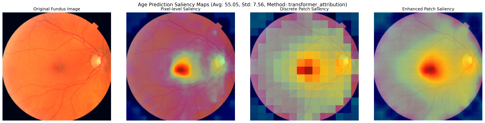
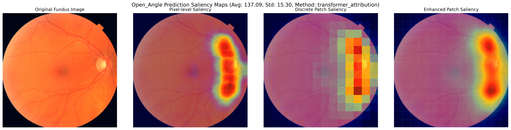
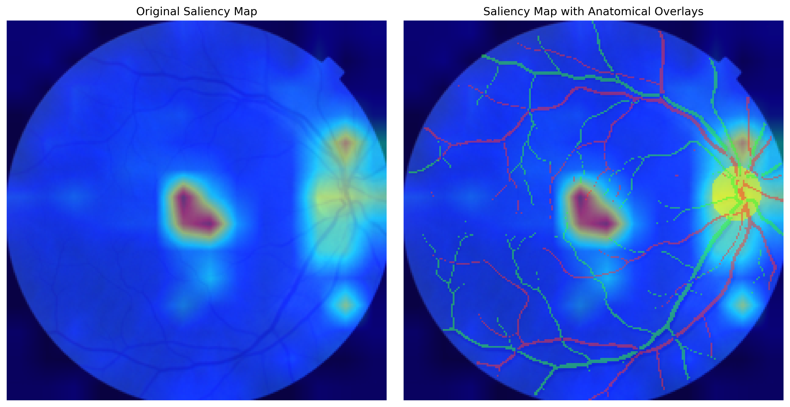

# RETFound Explainability Framework Technical Documentation

## Overview

This framework integrates the RETFound model with Transformer-Explainability techniques to generate saliency maps for retinal fundus image analysis. It helps visualize which regions of the retinal image the model focuses on when making predictions, providing valuable interpretability for both classification and regression tasks.

The framework generates saliency maps for regression and classification tasks. Besides generating a single saliency map for each input image, it also generates three types of overall saliency visualizations:

1. **Pixel-level overall saliency map**: Shows the most important highlight regions (top 10%) at pixel level across all processed images
2. **Patch-level overall saliency map (discrete)**: Shows importance at the transformer patch level with discrete boundaries
3. **Patch-level overall saliency map (smoothed)**: Provides an interpolated visualization of patch-level importance

### Examples of Overall Saliency Maps

Below are examples from regression tasks, showing overall saliency maps for age prediction and optic disc angle prediction:

#### Age Prediction


#### Optic Disc Angle Prediction


### Individual Saliency Map with Anatomical References

This example shows a single saliency map overlaid with segmented vessels (arteries in red, veins in green) and optic disc (yellow):



## Main Scripts

### 1. RETFound ViT Model with LRP

`RETFound_MAE/models_vit_lrp.py`

This script **extends the original RETFound Vision Transformer model with Layer-wise Relevance Propagation** capabilities. 

In [**Transformer-Explainability**](https://github.com/hila-chefer/Transformer-Explainability), the authors proposed the LRP method in https://github.com/hila-chefer/Transformer-Explainability/blob/main/baselines/ViT/ViT_LRP.py (referenced as the "**transformer_attribution**" method in the script) to propagate relevance backwards through Transformer models, attributing predictions to input features. Unlike gradient-based methods that may suffer from saturation and vanishing gradients, LRP ensures that relevance is conserved throughout the network layers, providing a more robust attribution map.

While the original authors only extended standard Vision Transformer models from https://github.com/huggingface/pytorch-image-models?tab=readme-ov-file#models, **our script incorporates LRP methods while preserving RETFound's ViT architectural innovations:**

- **LRP-compatible layer substitution**: Standard PyTorch layers have been replaced with specialized variants that implement the relevance conservation principle articulated by Bach et al. (2015). Each layer implements a custom relprop method that distributes relevance from higher layers to lower layers according to their contribution to the activation.
- **Attention mechanism instrumentation**: The self-attention modules have been instrumented to capture both attention patterns and their gradients, enabling the calculation of attention-based relevance flow through the network.
- **Dual-path architecture**: **The framework preserves RETFound's architectural innovations, particularly its global pooling approach for regression tasks, while extending both the CLS-token path and the global pooling path with relevance propagation capabilities.**

**These modifications maintain the predictive performance of the original RETFound model while enabling detailed inspection of the model's decision-making process.**

### 2. Saliency Map Generation for Classification Tasks:

`saliencymap_classification.py`

For classification tasks, the saliency map generation process follows a principled approach based on the Transformer-Explainability framework with adaptations for retinal image analysis:

1. **Forward propagation**: The input image is processed through the model to obtain class predictions.
2. **Relevance initialization**: The relevance at the output layer is initialized using a one-hot encoding of the target class (or predicted class if no target is provided). This creates a relevance vector that corresponds directly to the class of interest.
3. **Backward relevance propagation**: The relevance is propagated backward through the network using the relprop methods of each layer, following the conservation principle that ensures the total relevance is preserved.
4. **Transformer-specific attribution**: For Vision Transformers, specialized attribution methods are employed:
    
    a. **Transformer Attribution**: This method combines attention maps with their gradients to capture both the flow of information and its importance for the prediction:
    
    R_{ij}^l = ∑*{h=1}^{H} (∇A*{ij}^{l,h} · A_{ij}^{l,h})
    
    where A_{ij}^{l,h} is the attention from token i to token j in layer l for head h, and ∇A_{ij}^{l,h} is its gradient.
    
    This is the method proposed by the Transformer Explanability paper.
    
    b. **Rollout**: This method computes the attention flow through the network by matrix multiplication of attention maps across layers:
    
    R = ∏_{l=1}^{L} (I + A^l)
    
    where A^l is the attention matrix at layer l and I is the identity matrix.
    
5. **Feature map projection**: The token-space relevance is projected back to the pixel space, providing a fine-grained visualization of important image regions.

### 3. Saliency Map Generation for Regression Tasks:

`saliencymap_regression.py`

Regression tasks present a unique challenge for attribution methods as they lack discrete classes for relevance initialization. Our novel approach extends LRP principles to regression tasks:

1. **Specialized Regression LRP Class**: We created a dedicated RegressionLRP class （`RETFound_MAE/regression_lrp.py`) for handling regression tasks, as the original Transformer-Explainability framework was designed for classification.
2. **Forward propagation**: The input image is processed to obtain the continuous prediction value.
3. **Relevance initialization**: Instead of a one-hot encoding, we initialize relevance at the output layer with a unit vector, effectively treating the regression output as a single-class prediction:
    
    R_{output} = [1] ∈ ℝ^1
    
    This approach aligns with the theoretical framing of regression as predicting a continuous value in a one-dimensional output space.
    
4. **Backward relevance propagation**: The relevance is propagated through the network as in classification, but with careful handling of the global pooling layer that RETFound uses for regression tasks.
5. **Global pooling considerations**: For RETFound's global pooling approach, relevance is distributed equally across all non-CLS tokens, ensuring proper attribution when the model uses average pooling instead of the CLS token:
    
    R_{tokens} = R_{pooled}/N_{tokens}
    
    where N_{tokens} is the number of tokens (patches).
    
6. **Support for multiple attribution methods**: Similar to the classification implementation, our regression framework supports both the transformer attribution and rollout methods. 

This adaptation enables consistent and meaningful attribution for regression tasks, maintaining the theoretical soundness of LRP while accommodating the architectural nuances of RETFound.

## Overall Saliency Map Generation

`saliencymap_classification.py`

`saliencymap_regression.py`

A significant innovation of this framework is the generation of **overall saliency maps that capture consistent patterns across multiple images**. These maps address the need to **understand model attention patterns at a population level**, which is particularly valuable for clinical applications where systematic biases or attention patterns may impact model reliability.

### 1. Pixel-level Overall Saliency Map

The pixel-level overall saliency map quantifies the **frequency with which each pixel appears among the most important features across all analyzed images**, providing a statistical view of model attention.

**Methodology**:

1. For each image, we identify the **top k% most important pixels based on their attribution score. The default value of k is 10.**
2. We **construct a binary mask M_i for each image** i, where:
    
    M_i(x,y) = {
    1 if pixel (x,y) is in top k%
    0 otherwise
    }
    
3. We **accumulate these masks across all N images and normalize to obtain a frequency map**:
    
    F(x,y) = (1/N) ∑_{i=1}^{N} M_i(x,y)
    
4. To enhance visualization, we **apply Gaussian smoothing to the frequency map**:
    
    F̃ = G_σ * F
    
    where G_σ is a Gaussian kernel with standard deviation σ.
    

This approach is statistically robust and highlights pixels that are consistently important across multiple images, filtering out image-specific noise.

### 2. Patch-level Overall Saliency Map (Discrete)

The **discrete patch-level map visualizes importance at the transformer patch level**, providing insight into the model's attention at the architectural level of the Vision Transformer.

**Methodology**:

1. W**e average pixel-level attribution scores within each patch** to obtain patch importance:
    
    P(i,j) = (1/p²) ∑*{x=ip}^{(i+1)p-1} ∑*{y=jp}^{(j+1)p-1} A(x,y)
    
    where A(x,y) is the attribution score at pixel (x,y) and p is the patch size.
    
2. We **normalize patch importance scores to the [0,1] range**.
3. We visualize each patch as a colored rectangle with opacity proportional to its importance:
    
    α(i,j) = α_{min} + P(i,j) · (α_{max} - α_{min})
    
    where α_{min} and α_{max} control the transparency range.
    

This **visualization directly maps to the Vision Transformer's architectural units (patches)**, providing clear interpretation of which input regions influence the model's processing.

### 3. Patch-level Overall Saliency Map (Smoothed)

The smoothed patch-level map addresses the **visual discontinuities of the discrete approach while maintaining interpretability**, using established interpolation methods from scientific visualization.

**Methodology**:

1. We construct a **grid of patch importance values at patch centers:**
    
    G = {(x_i, y_j, P(i,j)) | x_i = (i+0.5)p, y_j = (j+0.5)p}
    
2. We **perform cubic interpolation to obtain a continuous importance function:**
    
    P̂(x,y) = Interp_{cubic}((x,y), G)
    
    where Interp_{cubic} is a cubic interpolation operator.
    
3. We **visualize the interpolated function with a continuous colormap and variable transparency**.

This approach preserves the interpretability benefits of patch-level visualization while providing a more aesthetically pleasing and potentially more intuitive representation through established scientific visualization principles.

All three overall saliency map methods are theoretically grounded in different aspects of attribution analysis and visualization, providing complementary perspectives on model attention patterns:

- The pixel-level map captures statistical consistency across images
- The discrete patch map directly maps to model architecture
- The smoothed patch map applies principles from scientific visualization to enhance interpretability

Together, these methods provide a comprehensive framework for understanding Vision Transformer behavior in retinal image analysis tasks.

### 4. Reference Image Selection

To show the above 3 overall saliency maps, we need to select  a retina fundus image from input folder as the reference image to overlay overall saliency maps. The user can explicitly define a reference image via the `-reference_image` parameter. This is the preferred method when a standardized, high-quality retinal image is available for visualization purposes.

```python
python saliencymap_regression.py \
    --checkpoint_path /path/to/checkpoint-best.pth \
    --input_folder /path/to/test_images \
    --reference_image /path/to/reference_image \
    --metric_name "Age" \
    --method transformer_attribution
```

Or if no reference image is specified, the framework automatically selects one from the input dataset based on image quality metrics:
a. **Quality assessment**: The framework evaluates a subset of images from the input folder, calculating standard deviation as a simple proxy for image quality and detail.
b. **Selection criteria**: The image with the highest standard deviation is selected, as this typically indicates a clearer, more detailed fundus image with good contrast between anatomical structures.
c. **Quality reporting**: The selection process reports the quality metric value of the chosen image, providing transparency about the selection process.

The selected reference image is then prepared for visualization:

1. It is normalized to ensure consistent intensity ranges for overlaying saliency information.
2. It is saved to the output directory for documentation purposes.
3. It serves as the base layer for all three types of overall saliency visualizations.

Using a consistent reference image across different visualizations enables direct comparison between the different saliency representation methods and provides important anatomical context for interpreting the model's attention patterns.

## Usage Instructions

### Requirements and Setup

1. Clone this repository:

```bash
git clone https://github.com/YatingPan/ocular-llm-explainability.git
cd ocular-llm-explainability
```

1. Set up the RETFound environment:
    
  ```bash
  cd RETFound_MAE
  # Follow RETFound installation instructions at https://github.com/rmaphoh/RETFound_MAE/tree/main to install retfound conda env  
  ```
    
2. Install Transformer-Explanability requirements in retfound conda env

  ```bash
  conda activate retfound
  cd ..
  cd Transformer-Explainability
  pip install -r requirements.txt
  ```

### Configuration

Before running the scripts, update the `BASELINE_PATH` in both `saliencymap_regression.py` and `saliencymap_classification.py`:

```python
# Set path to Transformer-Explainability -> Update this to your local path
BASELINE_PATH = "/path/to/your/Transformer-Explainability"
if BASELINE_PATH not in sys.path:
    sys.path.insert(0, BASELINE_PATH)
```

The framework can be used to generate saliency maps for both regression and classification tasks:

### Regression Tasks

```
python saliencymap_regression.py \
    --checkpoint_path /path/to/checkpoint-best.pth \
    --input_folder /path/to/test_images \
    --metric_name "Value" \
    --method transformer_attribution
```

### Classification Tasks

For classification task, first please modify the following code to specify the class labels you want to predict:

```python
def get_class_labels(num_classes):
    """Get dictionary of class labels"""
    # Example for DR grading (0-4):
    if num_classes == 5:
        return {
            0: 'No DR',
            1: 'Mild DR',
            2: 'Moderate DR',
            3: 'Severe DR',
            4: 'Proliferative DR'
        }
    # Default fallback
    return {i: f'class_{i}' for i in range(num_classes)}
```

```
python saliencymap_classification.py \
    --checkpoint_path /path/to/checkpoint-best.pth \
    --input_folder /path/to/test_images \
    --class_names "class" \
    --method transformer_attribution
```

## Output Structure

The framework generates the following outputs:

```
output_folder/
├── processed_inputs/           # Preprocessed input images with the build_transform function from RETFound_MAE/util/datasets.py
├── saliency_maps/              # Individual saliency maps for each image
├── overall/                    # Overall saliency visualizations
│   ├── reference_image.png     # Select a good quality image from processed images as the background to show overall saliency maps
│   ├── pixel_saliency.png      # Pixel-level saliency map
│   ├── discrete_patch_saliency.png  # Discrete patch-level saliency
│   ├── enhanced_patch_saliency.png  # Smoothed patch-level saliency
│   └── *_explanation_figure.png  # Combined visualization of above 3 overall saliency maps
└── predictions.csv             # CSV file with prediction/classification values

```

## Command-line Arguments

The `saliencymap_regression.py` provide numerous parameters for customization:

- `-checkpoint_path`: Path to the RETFound model checkpoint (required)
- `-input_folder`: Folder containing retinal fundus images (required)
- `-reference_image`: Path to a reference retina fundus image for overall saliency map overlay and visualization. The scripts will automatically select a good quality image from the input_folder as reference_image if there is no specification.
- `-input_size`: Input image size (default: 224, set by RETFound)
- `-drop_rate`: Dropout rate for the model (default: 0.0, set by RETFound)
- `-drop_path`: Drop path rate (stochastic depth) (default: 0.2, set by RETFound)
- `-global_pool`: Use global pooling for the model (default: True, set by RETFound)
- `-output_dim`: Output dimension for regression models (default: 1) . Removed in `saliencymap_regression.py`
- `-use_thresholding`: Apply Otsu thresholding on saliency maps
- `-debug`: Print debug information
- `-output_folder`: Custom output folder path. If there is no specification, the script will automatically create the output_folder parallel to the input folder
- `-metric_name`: Name of the regression metric (e.g., 'Angle', 'Age') (default: 'Value')
- `-alpha`: Transparency factor for overall saliency maps overlay visualization (0.0-1.0) (default: 0.6).
- `-method`: Method to generate saliency maps ("transformer_attribution" or "rollout") (default: "transformer_attribution")

For `saliencymap_regression.py`, additional parameters include:

- `-class_names`: Comma-separated list of class names
- `-target_class`: Specific class to generate saliency maps for (default: predicted class)

## References and Licenses

- **Transformer-Explainability (MIT License):**  
  [https://github.com/hila-chefer/Transformer-Explainability](https://github.com/hila-chefer/Transformer-Explainability)  
  (We adapted the LRP logic from this repository.)

- **RETFound:**  
  [https://github.com/rmapho/RETFound](https://github.com/rmapho/RETFound)  
  (The base ViT architecture and image transforms are derived from RETFound.)

- **Ocular-LLM-Explanability:**  
  This repository is intended for research and educational purposes only. It is not a medical device and should not be used for clinical decision-making.

For any questions or contributions, please open an issue or contact the repository maintainers.
